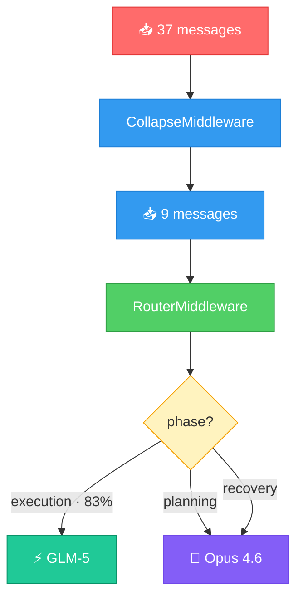

# langchain-router

[](https://pypi.org/project/langchain-router/)
[](https://opensource.org/licenses/MIT)
[](https://github.com/johanity/langchain-router/actions)

Your agent doesn't need the expensive model for every call.

Most calls are just the model picking which file to read next or which pattern to search for. A smaller model does that fine. This middleware detects when the agent is doing that kind of work and routes to a fast model automatically.

## Quick Install

```bash
pip install langchain-router
```

## 🤔 What is this?

Agent sessions have a pattern. The user says something, the agent thinks about it (planning). Then it reads files, searches code, runs commands (execution). Sometimes something breaks (recovery). Then the user says something again.

Planning and recovery need the primary model. Execution doesn't. RouterMiddleware detects which phase the agent is in and routes accordingly.

| What just happened | Phase | Model |
|---|---|---|
| User spoke | planning | primary |
| Tool call succeeded | execution | **fast** |
| Tool call failed | recovery | primary |

No ML. No embeddings. No classifier. Just message types.

```python
from langchain.agents import create_agent
from langchain_router import RouterMiddleware

agent = create_agent(
    model="anthropic:claude-sonnet-4-6",
    tools=[...],
    middleware=[RouterMiddleware(fast="anthropic:claude-haiku-4-5-20251001")],
)
```

### With CollapseMiddleware

```python
from langchain_collapse import CollapseMiddleware

middleware = [
    CollapseMiddleware(),
    RouterMiddleware(fast="anthropic:claude-haiku-4-5-20251001"),
]
```



### Verified with real API calls

81 real API calls across 9 model pairs, 4 providers. Each pair ran a 9-call agent session: planning, 6 execution turns, recovery from a failed tool call, and re-planning. Every call routed correctly. [Full per-call details](examples/verified_results.md).

| Primary | Fast | Provider | Calls | Routing |
|---------|------|----------|-------|---------|
| Claude Opus 4.6 | Claude Haiku 4.5 | Anthropic → Anthropic | 9 | 9/9 ✓ |
| Claude Opus 4.6 | GLM-5 | Anthropic → Z.ai | 9 | 9/9 ✓ |
| Claude Opus 4.6 | MiniMax M2.7 | Anthropic → MiniMax | 9 | 9/9 ✓ |
| Claude Sonnet 4.6 | GLM-5 | Anthropic → Z.ai | 9 | 9/9 ✓ |
| Claude Sonnet 4.6 | MiniMax M2.7 | Anthropic → MiniMax | 9 | 9/9 ✓ |
| GPT-5.4 | GPT-4.1-mini | OpenAI → OpenAI | 9 | 9/9 ✓ |
| GPT-5.4 | GLM-5 | OpenAI → Z.ai | 9 | 9/9 ✓ |
| GPT-5.4 | MiniMax M2.7 | OpenAI → MiniMax | 9 | 9/9 ✓ |
| GLM-5 | MiniMax M2.7 | Z.ai → MiniMax | 9 | 9/9 ✓ |

Patterns tested: same-provider (Anthropic→Anthropic, OpenAI→OpenAI), cross-provider (Anthropic→Z.ai, OpenAI→MiniMax), frontier→open (Opus→GLM-5, GPT-5.4→MiniMax), open→open (GLM-5→MiniMax).

### Cost impact

In a typical coding session (8 file reads, 4 greps, 1 edit, 1 test failure, 1 fix, 1 re-test, 2 user messages), 83% of model calls are execution phase and route to the fast model.

| Primary | Fast | Per session | Saved | Annual (10 devs, 20/day) |
|---------|------|-------------|-------|--------------------------|
| Opus 4.6 | MiniMax M2.7 | $4.19 → $0.75 | 82% | $171,938/yr |
| Opus 4.6 | GLM-5 | $4.19 → $0.80 | 81% | $169,125/yr |
| Opus 4.6 | Haiku 4.5 | $4.19 → $0.88 | 79% | $165,075/yr |
| Sonnet 4.6 | MiniMax M2.7 | $0.84 → $0.19 | 78% | $32,437/yr |
| GPT-5.4 | MiniMax M2.7 | $0.77 → $0.18 | 77% | $29,438/yr |
| GPT-5.4 | GPT-4.1-mini | $0.77 → $0.21 | 72% | $27,675/yr |
| Sonnet 4.6 | GLM-5 | $0.84 → $0.24 | 71% | $29,625/yr |
| GPT-5.4 | GLM-5 | $0.77 → $0.23 | 70% | $26,625/yr |
| GLM-5 | MiniMax M2.7 | $0.13 → $0.07 | 45% | $2,813/yr |

Token counts assumed for cost projection (8k input, 1.5k output per call). Pricing as of April 2026. See [benchmark](examples/benchmark.py) for methodology.

### On false positives

Recovery detection checks `ToolMessage.status` first (set by the agent when a tool call fails), then falls back to content scanning for `error`, `traceback`, `exception`, `failed`. Code containing those words (like `def handle_error`) routes to the primary model. That's the safe direction: more capability than needed, never less.

## 📖 Documentation

- [Source](langchain_router/__init__.py) (single file, ~170 lines)
- [Benchmark](examples/benchmark.py) (cost projections across providers)
- [Verified Results](examples/verified_results.md) (81 real API calls, 9 model pairs)
- [Tests](tests/) (unit, integration, and property based invariant tests)

## 💁 Contributing

```bash
git clone https://github.com/johanity/langchain-router.git
cd langchain-router
pip install -e ".[test]"
pytest
```

## 📕 License

MIT
